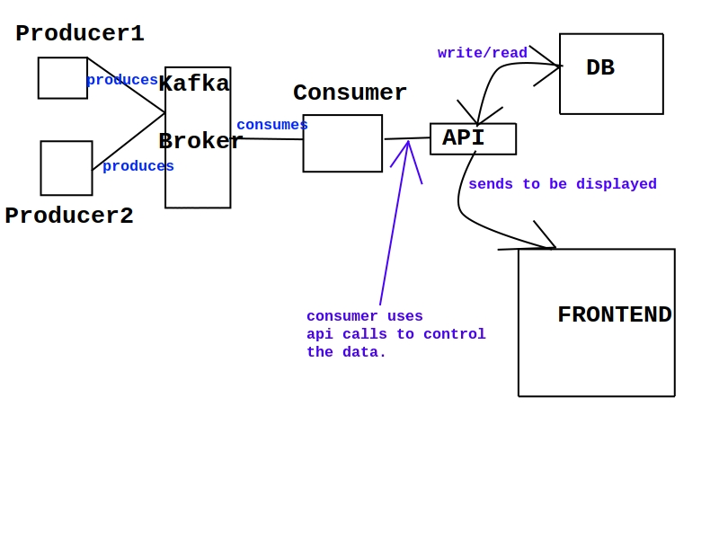

# archi micro projet

## TODO 

Dockerize everything
testapi.py api working
kafka working
bdd postgresql working
consumer and producer working


## Schema of structure



## Kafka

[kafka quickstart guide](https://kafka.apache.org/quickstart)

TODO:

### Data format sent to topic coordinates

The data is to the broker in the format: lat; long; Date; ip.<br>
Example: "-48.744897; -78.637573; 2023-12-27 16:03:41; 172.17.9.135"<br>

### launch broker on 2 terminal (go into kafka folder first)
```
bin/zookeeper-server-start.sh config/zookeeper.properties
```
```
bin/kafka-server-start.sh config/server.properties
``` 

### some command if it fails (go into kafka folder)

i needed to do this to install kafka i guess after cloning repo 

    ./gradlew jar -PscalaVersion=2.13.11

### test messages on 'test-topic'

write: 

    bin/kafka-console-producer.sh --topic test-topic --bootstrap-server localhost:9092

read: 

    bin/kafka-console-consumer.sh --topic test-topic --from-beginning --bootstrap-server localhost:9092

### create topic coordinates (one time only):

    bin/kafka-topics.sh --create --topic coordinates --bootstrap-server localhost:9092 --partitions 2 --replication-factor 1

### delete topic

	bin/kafka-topics.sh --bootstrap-server localhost:9092 --delete --topic coordinates

### list topics

	kafka-topics.sh --bootstrap-server localhost:9092 --list --command-config /path/to/client.properties
	
### kafka server logs:
    
    tail -f logs/server.log

### broker config (in server.properties):

    listeners=PLAINTEXT://localhost:9092
    
## Database POSTGRESQL

Once postgres installed (read requirements.txt)<br>
go into folder BDD/, and type ```createdb coords```<br>
if error : "role 'name' does not exist" then create a superuser
by following instructions below and by replacing cytech by
your name.
(to display users: once you type psql type \du)

### create super user for postgresql

    sudo -i -u postgres
    psql
    CREATE USER cytech WITH SUPERUSER CREATEDB CREATEROLE PASSWORD 'password';
    exit
    exit

### create empty database and restore the database into the empty one

    createdb -U cytech coords
    psql -U cytech -d coords -f db_microarchie.dump

## API 

### run api manually
```
uvicorn app:app --reload
```

## Docker 

### Run the docker-compose (postgres, front, kafka)
Changer l'adresse ip dans le docker-compose.ylm pour celle du pc qui lance la commande

```
docker-compose up
```

### Run the producer docker-compose (kafka)
```
cd producer
docker-compose -f producer-docker-compose.yml up
```

### Run the consumer docker-compose (kafka, api)
```
cd consumer
docker-compose -f consumer-docker-compose.yml up
```
